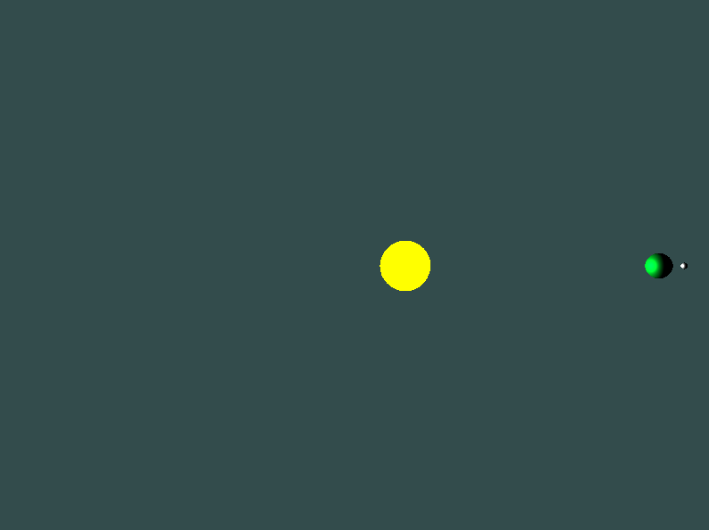
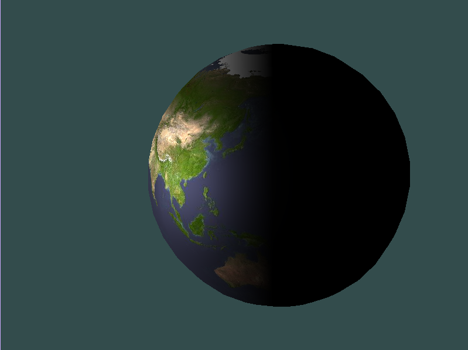
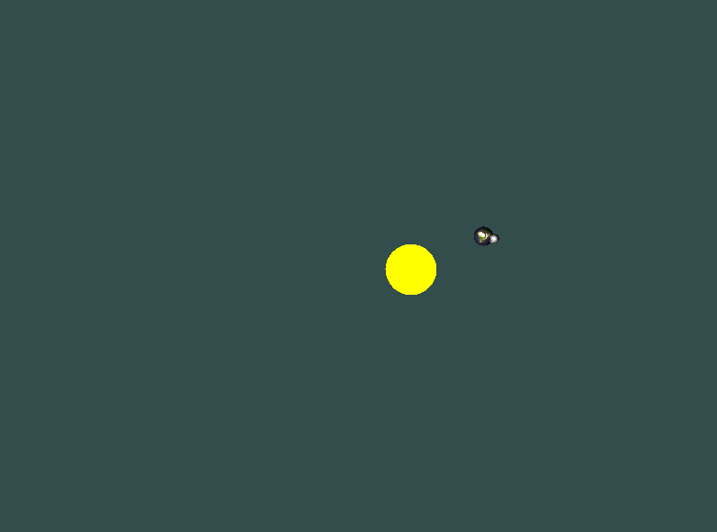

# Solar System

## How to

First download the project from github:
```bash
git clone https://github.com/MrBigoudi/SolarSystem.git
cd SolarSystem
```

Make sure you have the dependencies: glfw, glad and glm inside the dep folder
```bash
mkdir dep
cd dep
# install all 3 dependencies here
# the project should look like this:
# SolarSystem/
#            |_ dep/
#                  |_ glad/
#                  |_ glfw/
#                  |_ glm/
#            |_ docs/
#                  |_ Doxyfile.in
#            |_ include/
#                  |_ *.hpp
#            |_ media/
#                  |_ *.jpg
#            |_ report/
#                  |_ ...
#            |_ shaders/
#                  |_ *.glsl
#            |_ src/
#                  |_ *.cpp
#            |_ CMakeLists.txt
#            |_ README.md
```

To create the executable run the following:
```bash
cmake -B build
make -C build
```

This will create an executable and the documentation (cf [bonus](#bonus)).
To run the executable, use the following:
```bash
./build/SolarSystem
```

Have fun !

## Implementation

- Writting from scratch usefull class that I'll even be able to reuse for future project

- Press `w` to toggle back and forth the wireframe and press `q` to leave the window


- Creating the sphere using spherical coordinates


- Using the normals as the colors


- Creating the Phong's model


- Adding multiple planets and setting their properties



- Adding texture to the planets



- Adding all the rotations



## Bonus

- You can move the camera using the arrows and you can zoom in and zoom out by scrolling in the window.

- The code is made so that it is easy to add other planets or suns using the Planet and Sun classes.

- Generate documentation automatically using `Doxygen` (you can find it by opening `build/doc_doxygen/html/index.html` with your favorite browser)