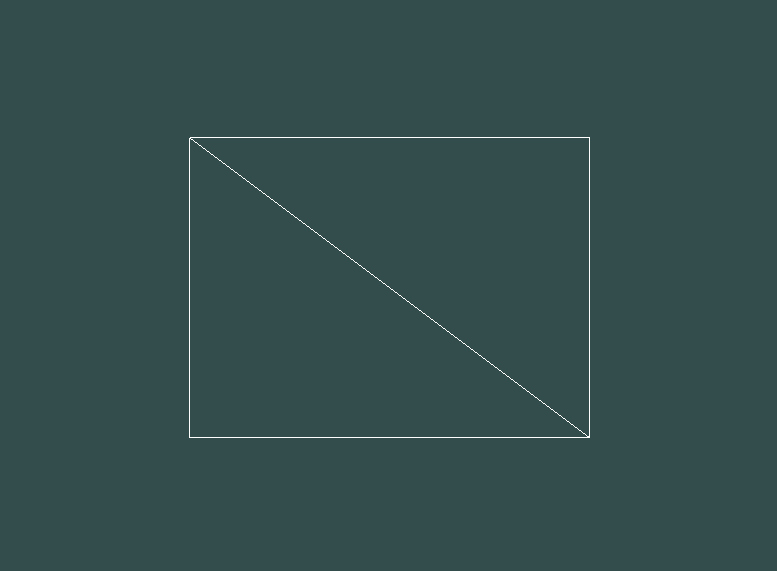
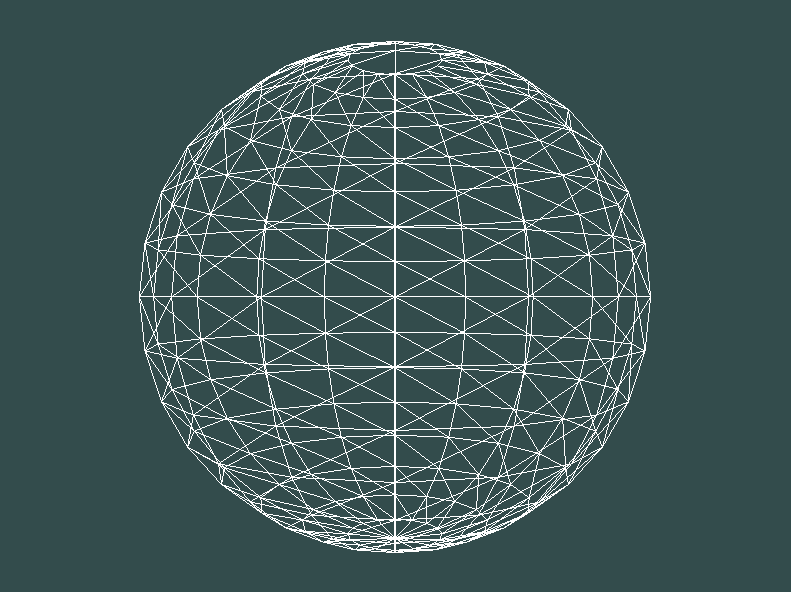
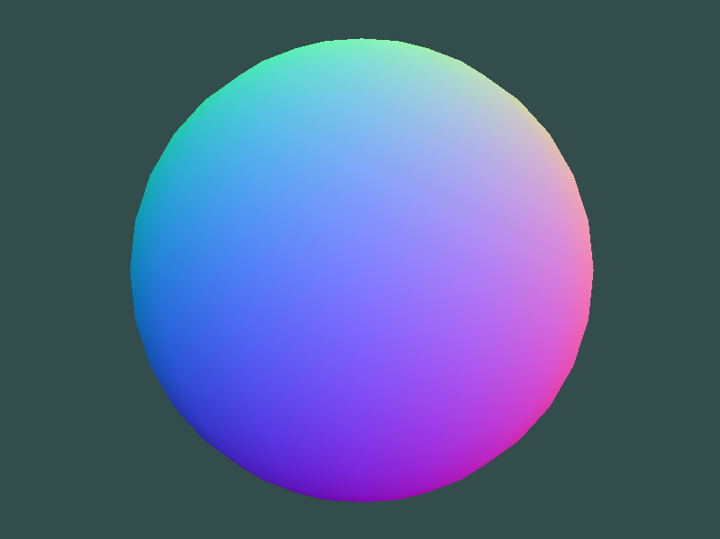
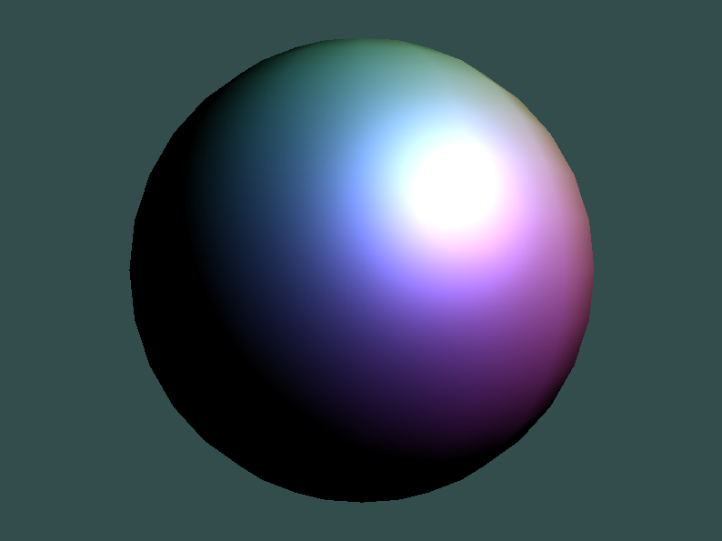

# Solar System

## Implementation

- Writting from scratch usefull class that I'll even be able to reuse for future project

- Press `w` to toggle back and forth the wireframe and press `q` to leave the window

- Creating the sphere using spherical coordinates

- Using the normals as the colors

- Creating the Phong's model

